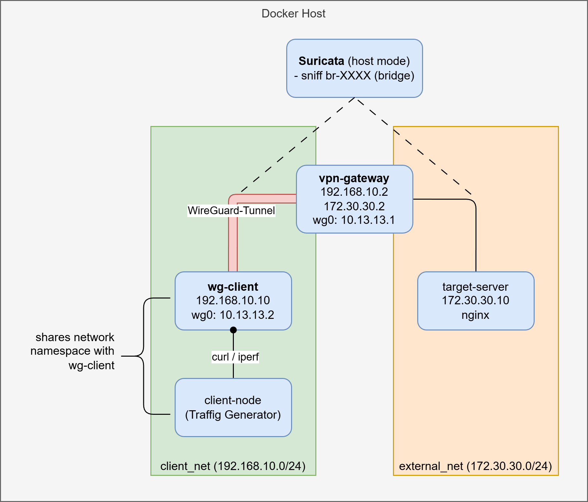

# VPN Obfuscation Lab (Bachelor Project)

This repository contains a reproducible Docker-based testbed to evaluate the detectability of VPN traffic (baseline WireGuard) and VPN obfuscation techniques (e.g., obfs4, udp2raw) using Suricata IDS.

---

## Project Structure

### Docker Compose Files (`compose/`)
The project uses **multiple compose files** for clarity and modularity, located in the `compose/` directory:

- `compose/compose.yml` – Base configuration (target, suricata, networks)
- `compose/compose.baseline.yml` – Baseline scenario: plain WireGuard
- `compose/compose.udp2raw.yml` – UDP2RAW obfuscation: WireGuard wrapped in TCP/443
- `compose/compose.obfs4.yml` – OBFS4 obfuscation: WireGuard wrapped in obfs4 protocol

### Services Directory
```
services/
├── client/              – Traffic generator (curl, iperf)
├── gateway/wireguard/   – WireGuard server config
├── gateway/udp2raw/     – UDP2RAW gateway config (server-side unwrapper)
├── wg-client/wireguard/ – WireGuard client config (baseline)
├── wg-client/udp2raw/   – WireGuard client config (UDP2RAW scenario)
├── wg-client/obfs4/     – WireGuard client config (OBFS4 scenario)
├── obfs4/               – OBFS4 proxy (Dockerfile + entrypoints)
└── suricata/            – IDS configuration and rules
```

### Results & Artifacts
```
results/
├── suricata-alerts/    – IDS outputs (eve.json, fast.log)
└── runs/
    ├── baseline/       – Baseline experiment results
    ├── udp2raw/        – UDP2RAW experiment results
    └── obfs4/          – OBFS4 experiment results
```

---

## Quickstart

### Prerequisites
1. Linux host (tested with Ubuntu / Arch Linux)
2. Docker Engine ≥ 24.x
3. Docker Compose v2
4. Kernel support for WireGuard (`wireguard`, `udp_tunnel`)
5. `bash`, `tcpdump` (for packet capture)

**Verify Docker:**
```bash
docker --version
docker compose version
```

### 1️⃣ Clone the repository
```bash
git clone https://github.com/maxlluky/vpn-lab.git
cd vpn-lab
```

### 2️⃣ Prepare environment variables
```bash
cp compose/.env.example compose/.env
```
Edit `compose/.env` if required. Key variables:
- `BRIDGE_IF`: Docker bridge interface (auto-detected by scripts)
- `UDP2RAW_GATEWAY_PORT`: TCP port for UDP2RAW (default: 443)
- `OBFS4_PORT`: TCP port for OBFS4 (default: 12345)

> ⚠️ Do not commit `compose/.env` — it may contain system-specific configuration.

---

## Scenarios

### Scenario 1: Baseline (Plain WireGuard)
Run the baseline WireGuard experiment without obfuscation:

```bash
bash scripts/run_baseline.sh
```

**What it does:**
- Starts `compose/compose.yml` + `compose/compose.baseline.yml`
- Captures UDP/51820 (WireGuard) packets
- Generates HTTP traffic through the VPN
- Collects Suricata IDS alerts
- Stores artifacts in `results/runs/baseline/<timestamp>/`

**Output files:**
```
results/runs/baseline/<timestamp>/
├── wg-baseline.pcap      – Captured WireGuard packets (tcpdump)
├── eve.json              – Suricata alerts (JSON format)
└── fast.log              – Suricata alerts (text format)
```

### Scenario 2: UDP2RAW Obfuscation
Run the UDP2RAW obfuscation experiment (WireGuard wrapped in TCP/443):

```bash
bash scripts/run_udp2raw.sh
```

**What it does:**
- Starts `compose/compose.yml` + `compose/compose.udp2raw.yml`
- Wraps WireGuard (UDP/51820) in TCP/443 using udp2raw
- Gateway unwraps TCP → UDP and forwards to WireGuard
- Client unwraps UDP ← TCP from the gateway
- Captures TCP/443 packets
- Generates HTTP traffic through the VPN
- Collects Suricata IDS alerts
- Stores artifacts in `results/runs/udp2raw/<timestamp>/`

**Network topology:**
```
[client-node] → [udp2raw-client] → (TCP/443) → [udp2raw-gateway] → [gateway/WireGuard]
```

### Scenario 3: OBFS4 Obfuscation
Run the OBFS4 obfuscation experiment:

```bash
bash scripts/run_obfs4.sh
```

**What it does:**
- Starts `compose/compose.yml` + `compose/compose.obfs4.yml`
- Wraps WireGuard (UDP/51820) in OBFS4 protocol using obfs4proxy
- Gateway accepts obfs4 connections and unwraps to WireGuard
- Client wraps UDP/51820 in obfs4 before sending
- Captures OBFS4 traffic (TCP port configured in `.env`)
- Generates HTTP traffic through the VPN
- Collects Suricata IDS alerts
- Stores artifacts in `results/runs/obfs4/<timestamp>/`

---

## Inspecting Results

### View Suricata Alerts (JSON)
```bash
jq '.alert | {timestamp, signature, severity}' results/suricata-alerts/eve.json
```

### View Suricata Fast Alerts (Text)
```bash
cat results/runs/baseline/<timestamp>/fast.log
```

### Analyze pcap with Wireshark
```bash
wireshark results/runs/baseline/<timestamp>/wg-baseline.pcap &
```

### Compare scenarios
```bash
# Count alerts per scenario
for scenario in baseline udp2raw obfs4; do
  count=$(jq '[.alert] | length' results/runs/$scenario/*/eve.json | tr -d '\n' | xargs)
  echo "$scenario: $count alerts"
done
```

---

## Cleanup

### Stop current stack
```bash
docker compose -f compose/compose.yml -f compose/compose.baseline.yml down
# or
docker compose -f compose/compose.yml -f compose/compose.udp2raw.yml down
# or
docker compose -f compose/compose.yml -f compose/compose.obfs4.yml down
```

### Remove all containers and networks
```bash
docker compose -f compose/compose.yml -f compose/compose.baseline.yml down -v
docker compose -f compose/compose.yml -f compose/compose.udp2raw.yml down -v
docker compose -f compose/compose.yml -f compose/compose.obfs4.yml down -v
```

### Clean experiment results (optional)
```bash
rm -rf results/runs/* results/suricata-alerts/*
```

---

## Architecture

### Network Topology


The testbed uses two isolated Docker networks:

- **`client_net` (192.168.10.0/24)** – VPN client-side network
- **`external_net` (172.30.30.0/24)** – External / target network
- **`internal_net` (192.168.20.0/24)** – Internal network for obfuscation proxies (UDP2RAW & OBFS4 only)

### Traffic Flow: Baseline
```
client-node (192.168.10.10)
    ↓
wg-client (WireGuard UDP/51820)
    ↓
gateway (192.168.10.2 ↔ 172.30.30.2)
    ↓
target (172.30.30.10)
```

### Traffic Flow: UDP2RAW
```
client-node (192.168.10.10)
    ↓
wg-client (127.0.0.1:51820)
    ↓
udp2raw-client (unwraps TCP/443 → UDP/51820)
    ↓ (TCP/443)
[external_net bridge]
    ↓ (TCP/443)
udp2raw-gateway (wraps TCP/443 → UDP/51820)
    ↓
gateway (WireGuard UDP/51820)
    ↓
target (172.30.30.10)
```

### Traffic Flow: OBFS4
```
client-node (192.168.10.10)
    ↓
wg-client (127.0.0.1:51820)
    ↓
obfs4-client (wraps UDP/51820 in OBFS4)
    ↓ (OBFS4 protocol, TCP/${OBFS4_PORT})
[external_net bridge]
    ↓ (OBFS4 protocol)
obfs4-gateway (unwraps OBFS4 → UDP/51820)
    ↓
gateway (WireGuard UDP/51820)
    ↓
target (172.30.30.10)
```

### Design Rationale
- **Separate compose files** ensure clarity: base + scenario-specific overrides
- **Identical client-node** across all scenarios guarantees the same application traffic
- **Automatic bridge detection** eliminates hardcoded interface names
- **Passive Suricata IDS** captures traffic on the external_net bridge
- **tcpdump** captures raw packets independently of Suricata

---

## Advanced Usage

### Run with custom parameters
```bash
# Generate 100 HTTP requests instead of 50
HTTP_REQUESTS=100 bash scripts/run_baseline.sh

# Capture for longer (keep tcpdump running for 5 extra seconds after traffic)
TCPDUMP_SECONDS_TAIL=5 bash scripts/run_baseline.sh
```

### Inspect container logs
```bash
# View WireGuard logs (baseline)
docker logs vpn-gateway

# View UDP2RAW logs
docker logs udp2raw-gateway
docker logs udp2raw-client

# View OBFS4 logs
docker logs obfs4-gateway
docker logs obfs4-client

# View Suricata logs
docker logs suricata-ids
```

### Rebuild a specific service
```bash
docker compose -f compose/compose.yml -f compose/compose.udp2raw.yml up -d --build wg-client
```

---

## Troubleshooting

### Bridge interface not found
If you see: `Bridge interface 'br-xxxx' not found on host`

Run the experiment script again, or manually set `BRIDGE_IF`:
```bash
BRIDGE_IF=br-a1b2c3d4e5f6 bash scripts/run_baseline.sh
```

### Suricata not starting
Check logs:
```bash
docker logs suricata-ids
```

Ensure `BRIDGE_IF` is set correctly in `.env`.

### WireGuard connection fails in UDP2RAW scenario
- Verify UDP2RAW containers are running: `docker ps | grep udp2raw`
- Check logs: `docker logs udp2raw-gateway` and `docker logs udp2raw-client`
- Ensure `UDP2RAW_GATEWAY_PORT=443` is accessible

### OBFS4 connection fails
- Verify OBFS4 containers are running: `docker ps | grep obfs4`
- Check logs: `docker logs obfs4-gateway` and `docker logs obfs4-client`
- Verify obfs4proxy built successfully: `docker logs obfs4-gateway`

---

## Contributing
This is a Bachelor project. Contributions are welcome! 

Please ensure:
- Scripts are POSIX-compliant
- Docker Compose files validate: `docker compose config`
- Results are excluded from Git (see `.gitignore`)

---

## License & Citation
[Insert license and citation information here]
