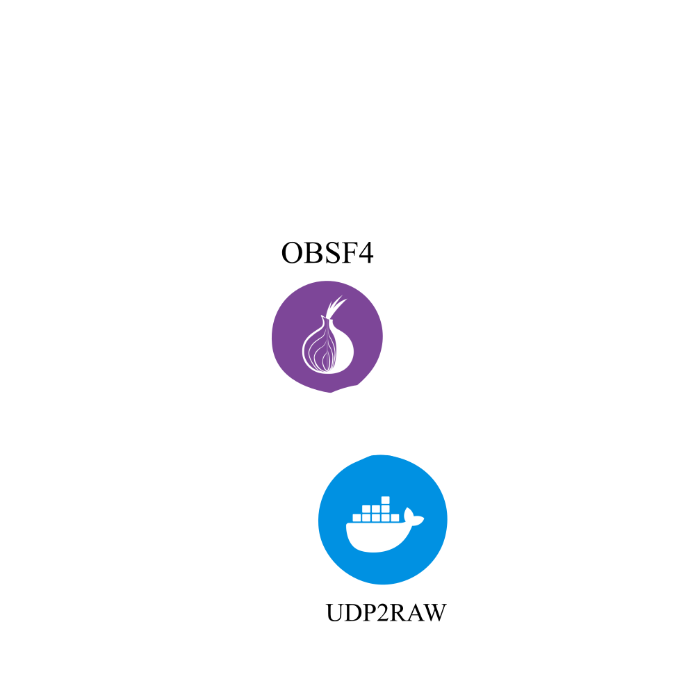

<div align="center">
    
</div>

# VPN Obfuscation Lab (Bachelor Project)
A reproducible Docker-based testbed to evaluate the detectability of VPN traffic (plain WireGuard) and VPN obfuscation techniques (UDP2RAW, OBFS4) using Suricata IDS, Zeek NSM, and nDPI Deep Packet Inspection.

**Max Luckert** · Wrexham University · [mluckert@outlook.de](mailto:mluckert@outlook.de)

---

## Table of Contents
1. [Project Structure](#project-structure)
2. [Quickstart](#quickstart)
3. [Traffic Modes](#traffic-modes)
4. [Scenarios](#scenarios)
5. [Detection Stack Validation](#detection-stack-validation)
6. [Analysis (Jupyter Notebook)](#analysis-jupyter-notebook)
7. [Architecture](#architecture)
8. [Cleanup](#cleanup)
9. [Troubleshooting](#troubleshooting)
10. [Citation](#citation)
11. [License](#license)

---

## Project Structure

### Compose Files (`compose/`)
| File | Purpose |
|---|---|
| `compose.yml` | Base stack: target, suricata, zeek, ndpi, networks |
| `compose.baseline.yml` | Scenario 1: plain WireGuard |
| `compose.udp2raw.yml` | Scenario 2: WireGuard wrapped in TCP/443 |
| `compose.obfs4.yml` | Scenario 3: WireGuard via Shadowsocks-rust + obfs4proxy |
| `compose.validate.yml` | IDS positive control (plain HTTP, no VPN) |

### Scripts (`scripts/`)
```text
scripts/
├── run_scenario.sh        – Main experiment runner (all scenarios + traffic modes)
├── lib.sh                 – Shared functions (stack management, capture, artifact collection)
├── validate_detection_stack.sh – Detection stack positive control (Suricata, Zeek, nDPI, PCAP)
├── cleanup.sh             – Tears down all containers, networks, volumes
└── pcap_to_packet_csv.sh  – Internal: extracts packet features via tshark
```

### Services (`services/`)
```text
services/
│
│   ── Detection ──────────────────────────────────────────────────────
├── suricata/             – IDS (ET Open ~49 k rules + custom WG behavioral rules)
├── zeek/                 – NSM (JSON conn.log output)
├── ndpi/                 – DPI (nDPI 5.0, built from source)
│
│   ── VPN & Proxies ───────────────────────────────────────────────────
├── vpn-client/           – WireGuard client configurations
│   ├── baseline/         – wg0.conf for Baseline
│   ├── udp2raw/          – wg0.conf for UDP2RAW
│   └── obfs4/            – wg0.conf for OBFS4
├── vpn-gateway/          – WireGuard server configurations
│   ├── baseline/         – Standard MTU config
│   ├── udp2raw/          – Low MTU + sidecar entrypoint.sh
│   └── obfs4/            – Low MTU config
├── proxy-obfs4/          – Shadowsocks-rust + obfs4proxy (SIP003 plugin via pt_adapter.py)
├── proxy-udp2raw/        – UDP2RAW proxy (fake-TCP/443 wrapping)
│
│   ── Clients & Traffic ───────────────────────────────────────────────
├── traffic-client/       – Traffic generator (Python HTTP + iperf3 streaming)
├── target-server/        – Nginx + iperf3 server (pre-installed in Dockerfile)
│   └── html/             – Static assets for HTTP burst traffic
└── http-client/          – IDS validation client (curl/bind-tools, no VPN)
```

### Results (`results/`)
```text
results/runs/<scenario>/<timestamp>/
├── metadata.json     – Scenario, mode, seed, tool versions
├── pcap/             – Raw packet capture (.pcap)
├── pcap_features/    – Tshark-extracted packets.csv
├── suricata/         – eve.json, fast.log
├── zeek/             – conn.log
├── ndpi/             – summary.txt, flows.csv
└── iperf/            – iperf.json (streaming mode only)
```

---

## Quickstart

### Prerequisites
- Linux host (tested on Ubuntu / Arch Linux)
- Docker Engine ≥ 24.x + Docker Compose v2
- Kernel WireGuard support (`wireguard`, `udp_tunnel` modules)
- `tcpdump` and `tshark` on the host:
```bash
# Ubuntu/Debian
sudo apt install tcpdump tshark
# Arch Linux
sudo pacman -S tcpdump wireshark-cli
```

### Setup
```bash
# 1. Clone
git clone https://github.com/maxlluky/VPN-Traffic-Obfuscation-Lab.git
cd VPN-Traffic-Obfuscation-Lab

# 2. Environment
cp compose/.env.example compose/.env
# Edit compose/.env if needed (UDP2RAW_IMAGE, BRIDGE_IF)

# 3. Validate detection stack
bash scripts/validate_detection_stack.sh

# 4. Run first experiment
bash scripts/run_scenario.sh baseline
```

> **WireGuard keys** are included for the lab environment. To regenerate: copy the `.template` files in `services/vpn-client/*/` and fill in new key pairs.

---

## Traffic Modes

| Mode | Description | Use for |
|---|---|---|
| **burst** (default) | 50 sequential HTTP requests | Connectivity check, quick alert generation |
| **streaming** | 60 s continuous iperf3 TCP stream | Throughput stats, flow analysis (Zeek) |

```bash
bash scripts/run_scenario.sh baseline            # burst (default)
bash scripts/run_scenario.sh baseline streaming  # streaming

# Full experiment set — 1× burst + 2× streaming per scenario (9 runs total)
# Two streaming runs per scenario provide mean ± 95 % CI throughput statistics (t-distribution).
for scenario in baseline udp2raw obfs4; do
  bash scripts/run_scenario.sh "$scenario" burst
  bash scripts/run_scenario.sh "$scenario" streaming
  bash scripts/run_scenario.sh "$scenario" streaming
done
```

---

## Scenarios

### Scenario 1: Baseline — Plain WireGuard
```bash
bash scripts/run_scenario.sh baseline
```
Plain WireGuard tunnel over UDP/51820. No obfuscation. Serves as the detection reference: nDPI identifies WireGuard, and the custom Suricata rules (SID 9000001/9000002) fire on the WireGuard handshake.

### Scenario 2: UDP2RAW — WireGuard in TCP/443
```bash
bash scripts/run_scenario.sh udp2raw
```
WireGuard UDP is wrapped in fake TCP using udp2raw and tunnelled over port 443. nDPI classifies the traffic as TLS (port-based match) but finds no TLS Client Hello — a clear FakeTCP indicator.

### Scenario 3: OBFS4 — Shadowsocks + obfs4proxy
```bash
bash scripts/run_scenario.sh obfs4
```
WireGuard is encrypted with Shadowsocks-rust (ChaCha20-Poly1305) and obfuscated via obfs4proxy as a SIP003 plugin (`pt_adapter.py`). Traffic on the wire is **UDP** on port 12345 with randomised payload. nDPI classifies it as Unknown — obfuscation is effective.

---

## Detection Stack Validation
Before drawing conclusions, run the positive control to confirm the detection stack is functional:

```bash
bash scripts/validate_detection_stack.sh
```

Sends plain HTTP (no VPN) and expects Suricata ET alerts, Zeek `service=http`, and nDPI HTTP classification. **Absence of alerts in VPN scenarios is a genuine finding, not a misconfiguration.**

---

## Analysis (Jupyter Notebook)

### Setup
```bash
python3 -m venv .venv
source .venv/bin/activate
pip install -r analysis/requirements.txt
```
Open `analysis/Analysis_Thesis.ipynb` in VS Code or JupyterLab (select the `.venv` kernel).

### What the notebook covers
1. **IDS Visibility (Suricata & Zeek)** - Alert counts per run; ET Open vs. custom WireGuard rule hits (SID 9000001/9000002); Zeek flow protocol detection
2. **Deep Packet Inspection (nDPI)** - Protocol fingerprinting results and per-scenario classification
3. **Traffic Fingerprinting** - Packet size and IAT distributions; TCP vs. UDP breakdown
4. **Protocol Plausibility Check** - TLS Client Hello presence on TCP/443 flows (UDP2RAW FakeTCP indicator)
5. **Performance** - Mean ± 95 % CI throughput per scenario (t-distribution, `t.ppf(0.975, df=n−1)`)
6. **Shannon Entropy** - Payload randomness from raw PCAP payloads; higher = more effective obfuscation
7. **Descriptive Statistics & KS Tests** - Size and IAT descriptive stats; pairwise Kolmogorov-Smirnov tests
8. **Summary Table** - Consolidated scenario × metric matrix for the thesis evaluation chapter

### Custom WireGuard Detection Rules
`services/suricata/rules/local.rules` contains two behavioral rules loaded alongside ET Open:
- **SID 9000001** - Handshake Initiator: UDP, 148 B payload, first 4 bytes `01 00 00 00`
- **SID 9000002** - Handshake Response: UDP, 92 B payload, first 4 bytes `02 00 00 00`

These detect WireGuard by **packet structure**, not port number. Only the Baseline scenario triggers them.

---

## Architecture

### Networks
| Network | Subnet | Purpose |
|---|---|---|
| `client_net` | 192.168.10.0/24 | VPN client side — capture point for all detection tools |
| `external_net` | 172.30.30.0/24 | Target server side |
| `internal_net` | 192.168.20.0/24 | Proxy-to-gateway links (UDP2RAW & OBFS4 only) |

### Traffic Flow: Baseline
```text
traffic-client (192.168.10.10)
    ↓  HTTP requests
wg-client  [WireGuard tunnel established]
    ↓  WireGuard encrypted UDP/51820
[client_net bridge]  ←  Suricata / Zeek / nDPI capture
    ↓  WireGuard encrypted UDP/51820
vpn-gateway (192.168.10.2 ↔ 172.30.30.2)  [decrypts]
    ↓  plain HTTP
target-server (172.30.30.10)
```

### Traffic Flow: UDP2RAW
```text
traffic-client (192.168.10.10)
    ↓  HTTP requests
wg-client  [WireGuard → 127.0.0.1:51820]
    ↓  WireGuard UDP/51820 (loopback)
proxy-udp2raw client  [wraps UDP → fake TCP/443]
    ↓  fake TCP/443
[client_net bridge]  ←  Suricata / Zeek / nDPI capture
    ↓  fake TCP/443
proxy-udp2raw gateway  [unwraps TCP → UDP/51820]
    ↓  WireGuard UDP/51820
vpn-gateway  [decrypts]
    ↓  plain HTTP
target-server (172.30.30.10)
```

### Traffic Flow: OBFS4
```text
traffic-client (192.168.10.10)
    ↓  HTTP requests
wg-client  [WireGuard → 127.0.0.1:51820]
    ↓  WireGuard UDP/51820 (loopback)
proxy-obfs4 client  [sslocal -U + obfs4proxy via SIP003]
    ↓  Shadowsocks ChaCha20 + obfs4 randomisation, UDP/12345
[client_net bridge]  ←  Suricata / Zeek / nDPI capture
    ↓  obfuscated UDP/12345
proxy-obfs4 gateway  [ssserver + obfs4proxy]
    ↓  WireGuard UDP/51820
vpn-gateway  [decrypts]
    ↓  plain HTTP
target-server (172.30.30.10)
```

> Unlike standard Tor obfs4 (TCP), this setup uses Shadowsocks-rust's `-U` UDP relay mode. The outer transport on the wire is **UDP**, not TCP.

---

## Cleanup
```bash
bash scripts/cleanup.sh          # stop all containers, remove networks & volumes
bash scripts/cleanup.sh --all    # also remove built images
sudo rm -rf results/*            # delete all experiment results (optional)
```

---

## Troubleshooting

**Bridge interface not found**
```bash
BRIDGE_IF=br-a1b2c3d4e5f6 bash scripts/run_scenario.sh baseline
```

**Suricata not starting**
```bash
docker logs suricata-ids   # check BRIDGE_IF is set correctly in .env
```

**UDP2RAW connection fails**
```bash
docker logs proxy-udp2raw   # verify UDP2RAW_GATEWAY_PORT=443 in .env
```

**OBFS4 connection fails**
```bash
docker logs obfs4-gateway
docker logs obfs4-client   # check pt_adapter.py started and certs match
```

---

## Citation
If you use this code or findings in your research, please cite:

```bibtex
@thesis{Luckert2026VPNObfuscation,
  author = {Max Luckert},
  title  = {Evaluation of VPN Traffic Camouflage and Obfuscation Techniques in Modern Network Security},
  school = {Wrexham University},
  year   = {2026},
  month  = {April},
  type   = {Bachelor's Thesis}
}
```

---

## License
© 2026 Max Luckert. This project is licensed under the [GNU General Public License v3.0](LICENSE).

You are free to use, study, modify, and distribute this project, provided that any derivative works are also released under GPL-3.0.
